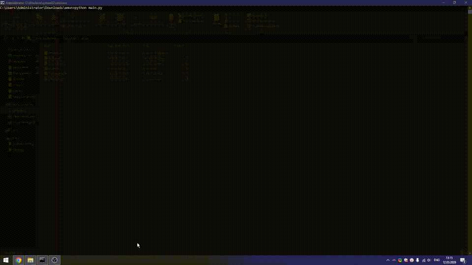

# Emunium

Human-like browser and desktop automation. No CDP, no WebDriver -- emunium drives Chrome through a custom WebSocket bridge and performs all mouse/keyboard actions at the OS level, making scripts indistinguishable from real user input. A standalone mode covers desktop apps via image template matching and OCR.



---

## Table of Contents

- [Installation](#installation)
- [Browser mode](#browser-mode)
- [Standalone mode](#standalone-mode)
- [Waiting](#waiting)
  - [Simple waits](#simple-waits)
  - [Advanced waits with conditions](#advanced-waits-with-conditions)
  - [Logical conditions (any\_of, all\_of, not\_)](#logical-conditions)
  - [Negative waits (detached/hidden)](#negative-waits)
  - [Soft waits](#soft-waits)
  - [Network waits](#network-waits)
  - [Standalone waits (OCR/image)](#standalone-waits)
- [Element API](#element-api)
- [Querying elements](#querying-elements)
- [Mouse interaction](#mouse-interaction)
- [Keyboard interaction](#keyboard-interaction)
- [Scrolling](#scrolling)
- [JavaScript execution](#javascript-execution)
- [Tab management](#tab-management)
- [PageParser and Locator](#pageparser-and-locator)
- [ClickType](#clicktype)
- [Optional extras](#optional-extras)
- [Advanced utilities](#advanced-utilities)
- [ensure\_chrome](#ensure_chrome)
- [Notes and limitations](#notes-and-limitations)

---

## Installation

```bash
pip install emunium
```

Optional extras:

```bash
pip install "emunium[standalone]"   # image template matching (OpenCV + NumPy)
pip install "emunium[ocr]"          # EasyOCR text detection
pip install "emunium[parsing]"      # fast HTML parsing with selectolax
pip install "emunium[keyboard]"     # low-level keyboard input
```

Chrome is downloaded automatically on first launch via `ensure_chrome()`.

---

## Browser mode

```python
from emunium import Browser, ClickType, Wait, WaitStrategy

with Browser(user_data_dir="my_profile") as browser:
    browser.goto("https://duckduckgo.com/")

    browser.type('input[name="q"]', "emunium automation")
    browser.click('button[type="submit"]', click_type=ClickType.LEFT)

    browser.wait(
        "a[data-testid='result-title-a']",
        strategy=WaitStrategy.STABLE,
        condition=Wait().visible().text_not_empty().stable(duration_ms=500),
        timeout=30,
    )

    print(browser.title, browser.url)

    for link in browser.query_selector_all("a[data-testid='result-title-a']")[:5]:
        print(f"  {link.text.strip()[:60]}  ({link.screen_x:.0f}, {link.screen_y:.0f})")
```

`Browser` constructor:

```python
Browser(
    headless=False,
    user_data_dir=None,   # persistent profile dir; temp dir if None
    bridge_port=0,        # 0 = OS-assigned
    bridge_timeout=60.0,  # seconds to wait for extension handshake
)
```

Properties: `browser.url`, `browser.title`, `browser.bridge`.

---

## Standalone mode

```python
from emunium import Emunium, ClickType

emu = Emunium()
matches = emu.find_elements("search_icon.png", min_confidence=0.8)
if matches:
    emu.click_at(matches[0], ClickType.LEFT)

fields = emu.find_elements("text_field.png", min_confidence=0.85)
if fields:
    emu.type_at(fields[0], "hello world")
```

With OCR:

```python
emu = Emunium(ocr=True, use_gpu=True, langs=["en"])
hits = emu.find_text_elements("Sign in", min_confidence=0.8)
if hits:
    emu.click_at(hits[0])
```

---

## Waiting

### Simple waits

All raise `TimeoutError` on timeout:

```python
browser.wait_for_element(selector, timeout=10.0)
browser.wait_for_xpath(xpath, timeout=10.0)
browser.wait_for_text(text, timeout=10.0)
browser.wait_for_idle(silence=2.0, timeout=30.0)
```

### Advanced waits with conditions

`Wait()` is a fluent builder. Conditions are ANDed by default:

```python
browser.wait(
    "#results",
    strategy=WaitStrategy.STABLE,
    condition=Wait().visible().text_not_empty().stable(500),
    timeout=15,
)
```

Available conditions:

| Method | Description |
|---|---|
| `.visible()` | Non-zero dimensions, not `visibility:hidden` |
| `.clickable()` | Visible, enabled, `pointer-events` not `none` |
| `.stable(duration_ms=300)` | Bounding rect unchanged for N ms |
| `.unobscured()` | Not covered by another element at center point |
| `.hidden()` | Element exists but is not visible |
| `.detached()` | Element removed from DOM or never appeared |
| `.text_not_empty()` | Inner text is non-empty after trim |
| `.text_contains(sub)` | Inner text includes substring |
| `.has_attribute(name, value=None)` | Attribute present (optionally with value) |
| `.without_attribute(name)` | Attribute absent |
| `.has_class(name)` | CSS class present |
| `.has_style(prop, value)` | Computed style property equals value |
| `.count_gt(n)` | More than N matching elements in DOM |
| `.count_eq(n)` | Exactly N matching elements in DOM |
| `.custom_js(code)` | Custom JS expression; receives `el` argument |

`WaitStrategy` values: `PRESENCE`, `VISIBLE`, `CLICKABLE`, `STABLE`, `UNOBSCURED`.

### Logical conditions

Combine conditions with OR/AND/NOT logic:

```python
# Wait for EITHER a success message OR a captcha box
element = browser.wait(
    "body",
    condition=Wait().any_of(
        Wait().has_class("success-loaded"),
        Wait().text_contains("Verify you are human")
    ),
    timeout=15,
)

# Explicit AND (same as chaining, but groups sub-conditions)
browser.wait(
    "#panel",
    condition=Wait().all_of(
        Wait().visible().text_not_empty(),
        Wait().has_attribute("data-ready", "true"),
    ),
)

# NOT: wait until element is no longer disabled
browser.wait(
    "#submit",
    condition=Wait().not_(Wait().has_attribute("disabled")),
)
```

### Negative waits

Wait for a loading spinner to be removed from the DOM:

```python
browser.click("#submit-btn")
browser.wait(".loading-spinner", condition=Wait().detached(), timeout=20)
```

Wait for an element to become hidden (still in DOM but invisible):

```python
browser.wait(".tooltip", condition=Wait().hidden(), timeout=5)
```

### Soft waits

Check for something without crashing when it doesn't appear. Pass `raise_on_timeout=False` to get `None` instead of `TimeoutError`:

```python
promo = browser.wait(
    ".promo-modal",
    condition=Wait().visible(),
    timeout=3.0,
    raise_on_timeout=False,
)
if promo:
    promo.click()
```

### Network waits

Wait for a specific background API request to finish before proceeding. Uses glob-style pattern matching against response URLs:

```python
browser.click("#fetch-data")
response = browser.wait_for_response("*/api/v1/users*", timeout=10.0)
if response:
    print(f"API status: {response['statusCode']}")
```

### Standalone waits

Polling waits for the standalone (non-browser) mode. These call `find_elements` / `find_text_elements` in a loop:

```python
emu = Emunium()

# Wait up to 10s for an image to appear on screen
match = emu.wait_for_image("submit_button.png", timeout=10.0, min_confidence=0.85)
emu.click_at(match)

# Wait for OCR text (requires ocr=True)
emu_ocr = Emunium(ocr=True)
hit = emu_ocr.wait_for_text_ocr("Payment Successful", timeout=30.0)
emu_ocr.click_at(hit)

# Soft standalone wait -- returns None on timeout
maybe = emu.wait_for_image("optional.png", timeout=3.0, raise_on_timeout=False)
```

---

## Element API

`Element` instances are returned by all query and wait methods.

Properties: `tag`, `text`, `attrs`, `rect`, `screen_x`, `screen_y`, `center`, `visible`.

```python
element.scroll_into_view()
element.hover(offset_x=None, offset_y=None, human=True)
element.move_to(offset_x=None, offset_y=None, human=True)
element.click(human=True)
element.double_click(human=True)
element.right_click(human=True)
element.middle_click(human=True)
element.type(text, characters_per_minute=280, offset=20, human=True)
element.drag_to(target, human=True)
element.focus()
element.get_attribute(name)
element.get_computed_style(prop)
element.refresh()  # re-query from page
```

---

## Querying elements

```python
browser.query_selector(selector)       # -> Element | None
browser.query_selector_all(selector)   # -> list[Element]
browser.get_by_text(text, exact=False) # -> list[Element]
browser.get_all_interactive()          # -> list[Element]
```

---

## Mouse interaction

```python
browser.click(selector, click_type=ClickType.LEFT, human=True, timeout=10.0)
browser.click_at(target, click_type=ClickType.LEFT, human=True, timeout=10.0)
browser.move_to(target, offset_x=None, offset_y=None, human=True, timeout=10.0)
browser.hover(target, ...)  # alias for move_to
browser.drag_and_drop(source_selector, target_selector, human=True)
browser.get_center(target)  # -> {"x": int, "y": int}
```

`target` can be a CSS selector string or an `Element`.

---

## Keyboard interaction

```python
browser.type(selector, text, characters_per_minute=280, offset=20, human=True)
browser.type_at(target, text, characters_per_minute=280, offset=20, human=True)
```

Non-ASCII text is pasted via clipboard (`pyperclip`). Install `emunium[keyboard]` for the `keyboard` library; otherwise `pyautogui` is used.

---

## Scrolling

```python
browser.scroll_to(element_or_selector)  # scroll element into viewport
browser.scroll_to(x, y)                 # scroll to absolute pixel coords
```

---

## JavaScript execution

```python
result = browser.execute_script("return document.title")
```

---

## Tab management

```python
browser.new_tab(url="about:blank")
browser.close_tab(tab_id=None)
browser.tab_info()  # -> dict with url, title, tabId, status
browser.page_info() # -> scrollX, scrollY, innerWidth, innerHeight, readyState, ...
```

---

## PageParser and Locator

Offline HTML parsing with CSS selectors. No browser needed.

```python
from emunium import PageParser

html = browser.execute_script("return document.documentElement.outerHTML")
parser = PageParser(html)

links = parser.locator("a[href]").all()
btn = parser.get_by_text("Sign in", exact=True).first
inputs = parser.get_by_role("textbox").all()
field = parser.get_by_placeholder("Search").first
email = parser.get_by_label("Email address").first
submit = parser.get_by_test_id("submit-btn").first
```

`Locator` supports: `.first`, `.last`, `.nth(i)`, `.all()`, `.count()`, `.inner_text()`, `.get_attribute(name)`, `.filter(has_text=...)`.

Requires `pip install "emunium[parsing]"`.

---

## ClickType

```python
from emunium import ClickType

ClickType.LEFT    # default
ClickType.RIGHT   # context menu
ClickType.MIDDLE
ClickType.DOUBLE
```

---

## Optional extras

| Extra | What it installs | What it unlocks |
|---|---|---|
| `standalone` | opencv-python, numpy | `find_elements()` image matching |
| `ocr` | opencv-python, numpy, easyocr | `find_text_elements()` OCR |
| `parsing` | selectolax | `PageParser` / `Locator` |
| `keyboard` | keyboard | Low-level keystroke delivery |

```bash
pip install "emunium[standalone,parsing,keyboard]"
```

---

## Advanced utilities

- `Bridge` -- the raw WebSocket transport to the Chrome extension. For custom messaging outside the `Browser` facade.
- `CoordsStore` -- thread-safe cache for element coordinates across async workflows.
- `ElementRecord` -- lightweight dataclass used by `CoordsStore`.

---

## ensure_chrome

```python
from emunium import ensure_chrome

path = ensure_chrome()
```

Downloads the latest stable Chrome for Testing build for the current platform if not already present. Called automatically by `Browser.launch()`.

---

## Notes and limitations

- Chrome only. The bridge extension targets Chrome/Chromium.
- One active tab at a time. The bridge tracks a single pinned tab. `new_tab()` switches focus.
- Parallel instances may conflict on the shared `port.json`. Use different `bridge_port` values.
- Non-ASCII text is pasted via clipboard instead of typed keystroke-by-keystroke.
- `headless=True` uses `--headless=new`. Coordinates still compute but the cursor is not visible. Use `human=False` in display-less environments.
- Image matching uses multi-scale (0.9x, 1.0x, 1.1x) and multi-rotation (-10, 0, +10) search.

---

## License

MIT
